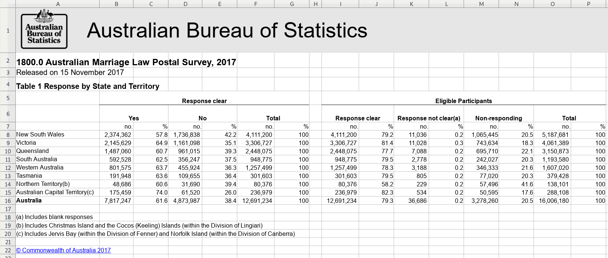
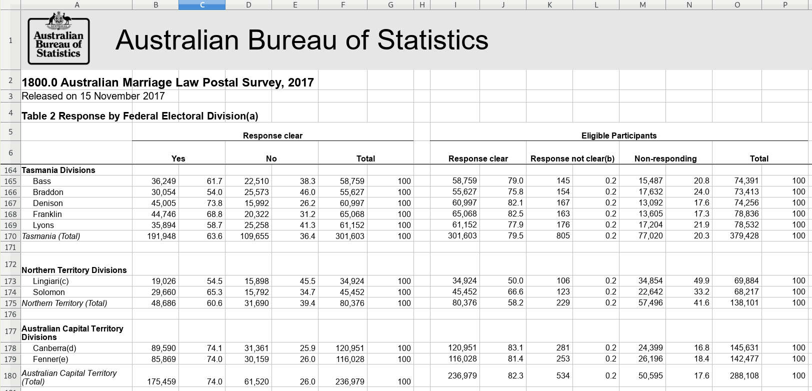

# Case studies

This is a collection of spreadsheets found in the wild.  Some are as easy to
mung as the examples; others are harder because their structure is less
consistent.

Seeing and reading the code will help you guage how much work is still involved
in munging a spreadsheet.  Attempting them for yourself and checking the model
answer will help you to hone your instincts.

The spreadsheet files are provided in the `smungs` package on GitHub.  Install
as follows.

```{r eval = FALSE}
# install.packages("devtools") # If you don't already have it
devtools::install_github("nacnudus/smungs")
```

## Australian Marriage Survey

[](https://twitter.com/MilesMcBain/status/932257990253645829)

These are the results of a survey in 2017 by the Australian Bureau of Statistics
that asked, "Should the law be changed to allow same-sex couples to marry?"

There are two tables with structures that are similar but different.  [Download
the
file](https://github.com/nacnudus/smungs/blob/master/inst/extdata/ozmarriage.xlsx?raw=true).
[Original source](http://www.abs.gov.au/ausstats/abs@.nsf/mf/1800.0).





### The full code listing

```{r}
cells <- xlsx_cells(smungs::ozmarriage)
formats <- xlsx_formats(smungs::ozmarriage)

table_1  <-
  cells %>%
  dplyr::filter(sheet == "Table 1", row >= 5L, !is_blank) %>%
  mutate(character = str_trim(character)) %>%
  behead("NNW", "population") %>%
  behead("NNW", "response") %>%
  behead("N", "unit") %>%
  behead("W", "state") %>%
  arrange(row, col) %>%
  select(row, data_type, numeric, state, population, response, unit) %>%
  spatter(unit) %>%
  select(-row)

state <-
  cells %>%
  dplyr::filter(sheet == "Table 2",
                row >= 5L,
                col == 1L,
                !is_blank,
                formats$local$font$bold[local_format_id]) %>%
  select(row, col, state = character)

table_2 <-
  cells %>%
  dplyr::filter(sheet == "Table 2",
                row >= 5L,
                !is_blank) %>%
  mutate(character = str_trim(character)) %>%
  behead("NNW", "population") %>%
  behead("NNW", "response") %>%
  behead("N", "unit") %>%
  behead("W", "territory") %>%
  enhead(state, "NNW") %>%
  arrange(row, col) %>%
  select(row, data_type, numeric, state, territory, population, response,
         unit) %>%
  spatter(unit) %>%
  select(-row)

all_tables <- bind_rows("Table 1" = table_1, "Table 2" = table_2, .id = "sheet")
all_tables
```

### Step by step

#### Table 1

The first rows, up to the column-headers, must be filtered out.  The trailing
rows below the table will be treated us row-headers, but because there is no
data to join them to, they will be dropped automatically.  That is handy,
because otherwise we would have to know where the bottom of the table is, which
is likely to change with later editions of the same data.

Apart from filtering the first rows, the rest of this example is 'textbook'.

```{r}
cells <- xlsx_cells(smungs::ozmarriage)

table_1  <-
  cells %>%
  dplyr::filter(sheet == "Table 1", row >= 5L, !is_blank) %>%
  mutate(character = str_trim(character)) %>%
  behead("NNW", "population") %>%
  behead("NNW", "response") %>%
  behead("N", "unit") %>%
  behead("W", "state") %>%
  arrange(row, col) %>%
  select(row, data_type, numeric, state, population, response, unit) %>%
  spatter(unit) %>%
  select(-row)

table_1
```

#### Table 2

This is like Table 1, broken down by division rather than by state.  The snag is
that the states are named in the same column as their divisions.  Because the
state names are formatted in bold, we can isolate them from the division names.
With them out of the way, unpivot the rest of the table as normal, and then use
`enhead()` at the end to join the state names back on.

Since tables 1 and 2 are so similar structurally, they might as well be joined
into one.

```{r}
cells <- xlsx_cells(smungs::ozmarriage)
formats <- xlsx_formats(smungs::ozmarriage)

state <-
  cells %>%
  dplyr::filter(sheet == "Table 2",
                row >= 5L,
                col == 1L,
                !is_blank,
                formats$local$font$bold[local_format_id]) %>%
  select(row, col, state = character)

table_2 <-
  cells %>%
  dplyr::filter(sheet == "Table 2",
                row >= 5L,
                !is_blank) %>%
  mutate(character = str_trim(character)) %>%
  behead("NNW", "population") %>%
  behead("NNW", "response") %>%
  behead("N", "unit") %>%
  behead("W", "territory") %>%
  enhead(state, "NNW") %>%
  arrange(row, col) %>%
  select(row, data_type, numeric, state, territory, population, response,
         unit) %>%
  spatter(unit) %>%
  select(-row)

all_tables <-
  bind_rows("Table 1" = table_1, "Table 2" = table_2, .id = "sheet") %>%
  select(sheet, state, territory, population, response, `%`, no.)
all_tables
```

## Vaccinations {#vaccinations}

[](https://twitter.com/hrbrmstr/status/890200287356620806)

This is a real-life example of [implied multiples](#implied-multiples).  Implied
multiples look like a single table, but many of the headers appear more than
once.  There is a dominant set of headers that are on the same 'level' (e.g. in
the same row) as the other headers.

In this case, there is a small multiple for each year of data.  The year headers
are highlighted in yellow in the screenshot.


The way to unpivot this is to realise that the year cells represent two
different things: the year (obviously) and a statistic (percentage vaccinated).
It would have been easier to unpivot if the years had been put into a separate
row of headers, so we will pretend that that was in fact the case.

1. Filter for the year cells and store in a variable to `enhead()` later.
1. `behead()` everything else as usual, and then overwite the year headers with
   `percentage_vaccinated`.
1. `enhead()` the year cells.

The original spreadsheet has been replaced by an [annual
refresh](https://www.cdc.gov/vaccines/vaxview/index.html), so you will need to
use the file from the [smungs](https://github.com/nacnudus/smungs) package.

```{r}
cells <- xlsx_cells(smungs::vaccinations, "SVV Coverage Trend Data")

years <-
  cells %>%
  dplyr::filter(row == 3,
                col >= 1,
                str_detect(character, "20[0-9]{2}-[0-9]{2}")) %>%
  select(row, col, year = character)
years

cells %>%
  select(row, col, data_type, character) %>%
  behead("NNW", "series") %>%
  behead("NNW", "population") %>%
  behead("W", "state") %>%
  behead("N", "header") %>%
  mutate(header = if_else(str_detect(header, "20[0-9]{2}-[0-9]{2}"),
                          "percent_vaccinated",
                          header),
         header = str_replace_all(str_to_lower(header), " ", "_")) %>%
  enhead(years, "NNW") %>%
  select(row, series, population, state, year, header, character) %>%
  spatter(header, character) %>%
  select(series, population, state, year, percent_vaccinated, percent_surveyed,
         everything())
```

## US Crime {#us-crime}

[](https://twitter.com/albertocairo/status/963133927530483712)

These are two tables of numbers of crimes in the USA, by state and category of
crime.  Confusingly, they're numbered Table 2 and Table 3.  Table 1 exists but
isn't included in this case study because it is so straightforward.

### Table 2 {#us-crime-2}


#### Simple version {#us-crime-2-simple}

This is straightforward to import as long as you don't care to organise the
hierarchies of crimes and areas.  For example, Conneticut is within the division
New England, which itself is within the region Northeast, but if you don't need
to express those relationships in the data then you can ignore the bold
formatting.

The only slight snag is that the header cells in row 5 are blank.  There is a
header for the units "Rate per 100,000", but no header for the units "Count" --
the cells in those positions are empty.  It would be a problem if the cells
didn't exist at all, because `behead("N", "unit")` wouldn't be able to associate
data cells with missing header cells.  Fortunately they do exist (because they
have formatting), they are just empty or `NA`.  To make sure they aren't
ignored, use `drop_na = FALSE` in `behead()`, and then later fill the blanks in
the `units` column with `"Count"`.

```{r}
cells <-
  xlsx_cells(smungs::us_crime_2) %>%
  mutate(character = map_chr(character_formatted,
                             ~ ifelse(is.null(.x), character, .x$character[1])),
         character = str_replace_all(character, "\n", " "))

cells %>%
  dplyr::filter(row >= 4L) %>%
  select(row, col, data_type, character, numeric) %>%
  behead("NNW", "crime") %>%
  behead("N", "unit", drop_na = FALSE) %>%
  behead("WNW", "area") %>%
  behead("W", "year") %>%
  behead("W", "population") %>%
  dplyr::filter(year != "Percent change") %>%
  mutate(unit = if_else(unit == "", "Count", unit)) %>%
  select(row, data_type, numeric, unit, area, year, population, crime) %>%
  spatter(unit) %>%
  select(-row)
```

#### Complex version {#us-crime-2-complex}

If you do mind about grouping states within divisions within regions, and
crimes within categories, then you have more work to do using `enhead()` rather
than `behead()`.

1. Select the header cells at each level of the hierarchy and store them in
   their own variables.  For example, filter for the bold cells in row 4, which
   are the categories of crimes, and store them in the `categories` variable.
1. Select the data cells, and use `enhead()` to join them to the headers.

In fact the headers `unit`, `year`, `population` can be handled by `behead()`,
because they aren't hierarchichal, so only the variables `category`, `crime`,
`region`, `division` and `state` are handled by `enhead()`.

```{r}
cells <-
  xlsx_cells(smungs::us_crime_2) %>%
  mutate(character = map_chr(character_formatted,
                             ~ ifelse(is.null(.x), character, .x$character[1])),
         character = str_replace_all(character, "\n", " "))

formats <- xlsx_formats(smungs::us_crime_2)

categories <-
  cells %>%
  dplyr::filter(row == 4L,
                data_type == "character",
                formats$local$font$bold[local_format_id]) %>%
  select(row, col, category = character)
categories

crimes <-
  cells %>%
  dplyr::filter(row == 4L, data_type == "character") %>%
  mutate(character = if_else(character %in% categories$category,
                             "Total",
                             character)) %>%
  select(row, col, crime = character)
crimes

regions <-
  cells %>%
  dplyr::filter(row >= 6L,
                col == 1L,
                data_type == "character",
                formats$local$font$bold[local_format_id]) %>%
  select(row, col, region = character)
regions

divisions <-
  cells %>%
  dplyr::filter(row >= 6L,
                col == 1L,
                data_type == "character",
                !formats$local$font$bold[local_format_id],
                !str_detect(character, "^ {5}")) %>%
  select(row, col, division = character)
divisions

states <-
  cells %>%
  dplyr::filter(row >= 6L,
                col == 1L,
                data_type == "character") %>%
  mutate(character = if_else(str_detect(character, "^ {5}"),
                             str_trim(character),
                             "Total")) %>%
  select(row, col, state = character)
states

cells %>%
  dplyr::filter(row >= 5L, col >= 2L) %>%
  select(row, col, data_type, character, numeric) %>%
  behead("N", "unit") %>%
  behead("W", "year") %>%
  behead("W", "population") %>%
  enhead(categories, "NNW") %>%
  enhead(crimes, "NNW") %>%
  enhead(regions, "WNW") %>%
  enhead(divisions, "WNW", drop = FALSE) %>%
  enhead(states, "WNW", drop = FALSE) %>%
  dplyr::filter(year != "Percent change") %>%
  select(value = numeric, category, crime, region, division, state, year, population)
```

#### Table 3 {#us-crime-3}


This table is confusing to humans, let alone computers.  The `Population` column
seems to belong to a different table altogether, so that's how we'll treat it.

1. Import the `Population` column and the state/area headers to the left.
1. Import the crime-related column headers, and the state/area headers to the left.
1. Join the two datasets.

The `statistic` header ends up having blank values due to the cells being blank,
so these are manually filled in.

The hierarchy of crime (e.g. 'robbery' is within 'violent crime') is ignored.
That would be handled in the same way as for [Table 2](#us-crime-2).

```{r}
cells <-
  xlsx_cells(smungs::us_crime_3) %>%
  mutate(character = map_chr(character_formatted,
                             ~ ifelse(is.null(.x), character, .x$character[1])),
         character = str_replace_all(character, "\n", " "))

population <-
  cells %>%
  dplyr::filter(row >= 5L, col <= 4L) %>%
  behead("WNW", "state") %>%
  behead("WNW", "area") %>%
  behead("W", "statistic", drop_na = FALSE) %>%
  mutate(statistic = case_when(is.na(statistic) ~ "Population",
                               statistic == "" ~ "Population",
                               TRUE ~ str_trim(statistic))) %>%
  dplyr::filter(data_type == "numeric",
                !str_detect(area, regex("total", ignore_case = TRUE)),
                statistic != "Estimated total") %>%
  select(data_type, numeric, state, area, statistic) %>%
  spatter(statistic)

crime <-
  cells %>%
  dplyr::filter(row >= 4, col != 5L) %>%
  behead("WNW", "state") %>%
  behead("WNW", "area") %>%
  behead("W", "statistic", formatters = list(character = str_trim)) %>%
  behead("N", "crime") %>%
  dplyr::filter(data_type == "numeric",
                !str_detect(area, regex("total", ignore_case = TRUE)),
                !is.na(statistic),
                statistic != "") %>%
  mutate(statistic = case_when(statistic == "Area actually reporting" ~ "Actual",
                               statistic == "Estimated total" ~ "Estimated")) %>%
  select(data_type, numeric, state, area, statistic, crime) %>%
  spatter(statistic)

left_join(population, crime)
```
