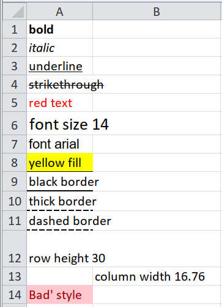
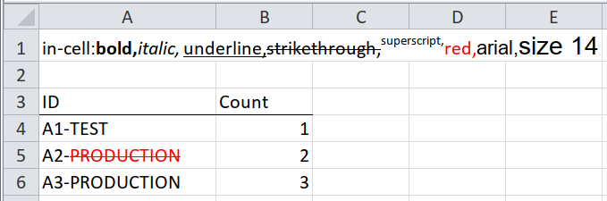
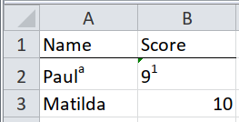

# Formatting

This part explains in detail how to extract and interpret cell and in-cell
formatting.  Earlier sections have used formatting, but haven't explained
exactly how it works.  The motivating example is a particularly pernicious
gotcha: [superscript symbols](#superscript-symbols).

The formatting of a cell is available via a lookup table.  Well, not a lookup
table -- a lookup list-of-lists-(of-lists-)of-vectors.  It seems complicated,
but in fact it is straightforward to find out a cell's formatting.

1. Obtain the vector of formats that you need.
1. Look up the cell's `style_format` or `local_format_id` in that vector.

## An example formatting lookup



This example shows how to look up whether a cell is bold.

```{r}
path <- system.file("extdata", "worked-examples.xlsx", package = "unpivotr")
path <- system.file("extdata", "worked-examples.xlsx", package = "unpivotr")
cells <-
  xlsx_cells(path, sheet = "formatting") %>%
  select(row, col, character, style_format, local_format_id)
cells

formats <- xlsx_formats(path)
bold <- formats$local$font$bold # The list of lists of lists of vectors
bold

mutate(cells, bold = bold[local_format_id])
```

A quick way to see what formatting definitions exist is to use `str()`.  (Scroll
past this for now -- you don't need to memorise it).

```{r}
formats <- xlsx_formats(path)
str(formats)
```

Why is this so complicated?  For one thing, there are too many types of
formatting available to include in the data frame given by `xlsx_cells()`.

Consider borders: each cell can have a border on each of its four sides, as well
as through the middle of the cell horizontally, vertically, diagonally up and
diagonally down.  Each border can have its own colour and linetype.  Colour can
be expressed as an RGB value, a theme number with or without a tint, or an index
number.

To express that in a data frame would take (4 sides + 4 through the middle) * (4
ways to express colour + 1 linetype) = 40 columns.  Just for borders.

Instead, Excel dynamically defines combinations of formatting, as they occur,
and gives ID numbers to those combinations.  Each cell has a formatting ID,
which is used to look up its particular combination of formats.  Note that this
means two cells that are both bold can have different formatting IDs, e.g. if
one is also italic.

There is also a hierarchy of formatting.  The first formatting to be applied is
the 'style'.  Every cell has a style, which by default is the 'normal' style.
You can reformat all cells of the 'normal' style at once by updating the
'normal' style.  Style formats are available under `xlsx_formats()$style`

When you modify the format of a particular cell, then that modification is local
to that cell.  The cell's local formatting is available under
`xlsx_formats()$local`.  Both `$style` and `$local` have the same structure, so
it's easy to switch from checking a cell's style-level formatting to its local
formatting.

Here's an example of looking up both the local bold formatting and the
style-level bold formatting of a cell.

```{r}
path <- system.file("extdata", "worked-examples.xlsx", package = "unpivotr")
cells <-
  xlsx_cells(path, sheet = "formatting") %>%
  select(row, col, character, style_format, local_format_id) %>%
  dplyr::filter(row == 1, col == 1)
cells

formats <- xlsx_formats(path)

local_bold <- formats$local$font$bold
local_bold

style_bold <- formats$style$font$bold
style_bold

mutate(cells,
       style_bold = style_bold[style_format],
       local_bold = local_bold[local_format_id])
```

Most of the time you will use the local formatting.  You only need to check the
style formatting when styles have been used in the spreadsheet (rare) and you
want to ignore any local modifications of that style for particular cells.

Conditional formatting is an obvious omission.  It isn't supported by tidyxl
because it doesn't encode any new information; it's responds to cell values,
which you already have.  If you think you need it, feel free to open an
[issue](https://github.com/nacnudus/tidyxl/issues).

## Common formats


This example shows how to look up the most common formats.

```{r}
path <- system.file("extdata", "worked-examples.xlsx", package = "unpivotr")
cells <-
  xlsx_cells(path, sheet = "formatting") %>%
  select(row, col, character, style_format, local_format_id, height, width)

formats <- xlsx_formats(path)

bold <- formats$local$font$bold
italic <- formats$local$font$italic
underline <- formats$local$font$underline
strikethrough <- formats$local$font$strike
font_colour <- formats$local$font$color$rgb
fill_colour <- formats$local$fill$patternFill$fgColor$rgb
font_size <- formats$local$font$size
font_name <- formats$local$font$name
border_colour <- formats$local$border$right$color$rgb
border_linetype <- formats$local$border$right$style

mutate(cells,
       bold = bold[local_format_id],
       italic = italic[local_format_id],
       underline = underline[local_format_id],
       strikethrough = strikethrough[local_format_id],
       font_colour = font_colour[local_format_id],
       font_size = font_size[local_format_id],
       font_name = font_name[local_format_id],
       fill_colour = fill_colour[local_format_id],
       border_colour = border_colour[local_format_id],
       border_linetype = border_linetype[local_format_id])
```

## In-cell formatting



The previous section was about formatting applied at the level of cells.  What
about when multiple formats are applied within a single cell?  A single word in
a string might be a different colour, to stand out.

Unlike cell-level formatting, in-cell formatting is very limited, so it can be
provided as a data frame with the following columns.

* bold
* italic
* underline
* strike
* vertAlign
* size
* color_rgb
* color_theme
* color_indexed
* color_tint
* font
* family
* scheme

There is one of these data frames for each cell, and they are kept in a
list-column called `character_formatted`.

```{r}
path <- system.file("extdata", "worked-examples.xlsx", package = "unpivotr")
xlsx_cells(path, sheet = "in-cell formatting") %>%
  select(address, character_formatted)
```

The way to access these data frames is via `tidyr::unnest()`.  In this example,
a single cell has a long string of words, where each word is formatted
differently.

```{r}
xlsx_cells(path, sheet = "in-cell formatting") %>%
  dplyr::filter(address == "A1") %>%
  select(address, character_formatted) %>%
  unnest()
```

It's hard to think of a plausible example, so what follows is an implausible one
that nevertheless occurred in real life.

## Multiple pieces of information in a single cell, with meaningful formatting


The above table of products and their production readiness combines three pieces
of information in a single cell.  Believe it or not, this is based on a
real-life example.

```{r}
path <- system.file("extdata", "worked-examples.xlsx", package = "unpivotr")
xlsx_cells(path, sheet = "in-cell formatting") %>%
  dplyr::filter(address != "A1") %>%
  rectify()
```

In the `ID` column, the first section `"A1"`, `"A2"`, `"A3"` is the product ID.
The second section `"TEST"`, `"PRODUCTION"` is the production readiness, and the
formatting of `"TEST"` and `"PRODUCTION"` shows whether or not manufacturing
failed.  In the file, one of those strings is formatted red with a
strikethrough, indicating failure.

One way to extract the formatting is by unnesting, as above, but in this case we
can get away with mapping over the nested data frames and pulling out a single
value.

```{r}
strikethrough <-
  xlsx_cells(path, sheet = "in-cell formatting") %>%
  dplyr::filter(address != "A1", col == 1) %>%
  mutate(strikethrough = map_lgl(character_formatted, ~ any(.x$strike))) %>%
  select(row, col, character, strikethrough)
```

This can then be joined onto the rest of the table, in the same way as the
section "Already a tidy table but with meaningful formatting of single cells".

```{r}
cells <-
  xlsx_cells(path, sheet = "in-cell formatting") %>%
  dplyr::filter(address != "A1") %>%
  select(row, col, data_type, character, numeric)

strikethrough <-
  xlsx_cells(path, sheet = "in-cell formatting") %>%
  dplyr::filter(address != "A1", col == 1) %>%
  mutate(strikethrough = map_lgl(character_formatted, ~ any(.x$strike))) %>%
  select(row, strikethrough)

left_join(cells, strikethrough, by = "row") %>%
  behead("N", header) %>%
  select(-col) %>%
  spatter(header) %>%
  select(ID, strikethrough, Count)
```

## Superscript symbols {#superscript-symbols}



This is pernicious.  What was Paula's score, in the table below?

```{r}
path <- system.file("extdata", "worked-examples.xlsx", package = "unpivotr")
read_excel(path, sheet = "superscript symbols")
```

The answer is, it's not Paula, it's Paul (superscript 'a'), who scored 9
(superscript '1').

This sort of thing is difficult to spot.  There's a clue in the 'Score' column,
which has been coerced to character so that the author could enter the
superscript '1' (Excel doesn't allow superscripts in numeric cells), But it
would be easy to interpret that as an accident of translation, and simply coerce
back to numeric with `as.integer()`.

With tidyxl, you can count the rows of each element of the `character_formatted`
column to identify cells that have in-cell formatting.

```{r}
xlsx_cells(path, sheet = "superscript symbols") %>%
  dplyr::filter(data_type == "character") %>%
  dplyr::filter(map_int(character_formatted, nrow) != 1) %>%
  select(row, col, character)
```

The values and symbols can then be separated by assuming the value is the first
string, and the symbol is the second.

```{r}
xlsx_cells(path, sheet = "superscript symbols") %>%
  mutate(character = map_chr(character_formatted,
                             ~ ifelse(is.null(.x), character, .x$character[1])),
         symbol = map_chr(character_formatted,
                          ~ ifelse(is.null(.x), NA, .x$character[2])),
         numeric = if_else(row > 1 & col == 2 & data_type == "character",
                           as.numeric(character),
                           numeric),
         character = if_else(is.na(numeric), character, NA_character_)) %>%
  select(row, col, numeric, character, symbol)
```

