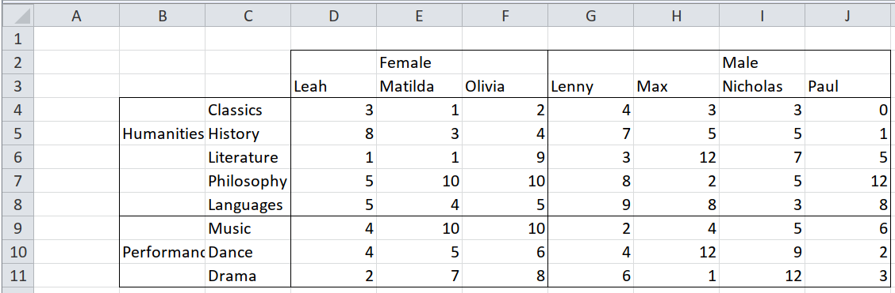
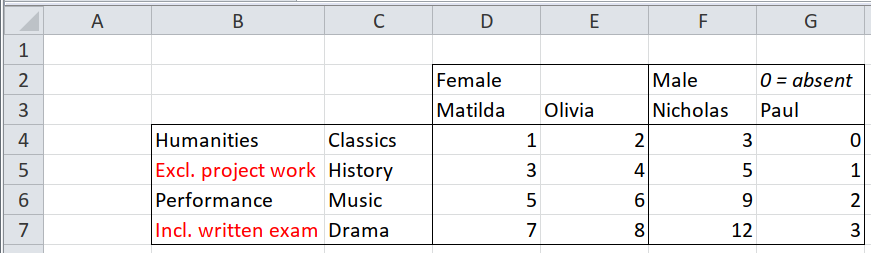
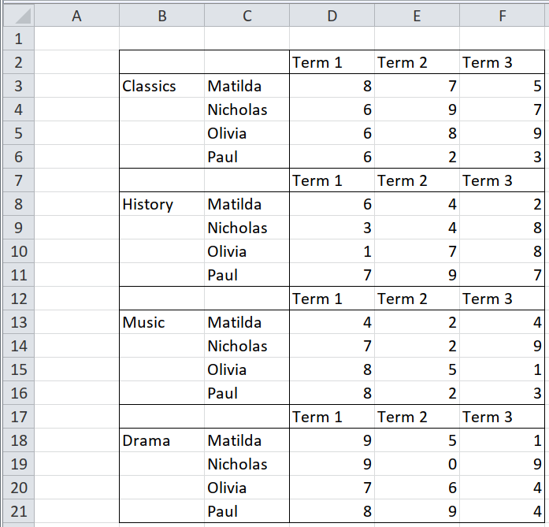
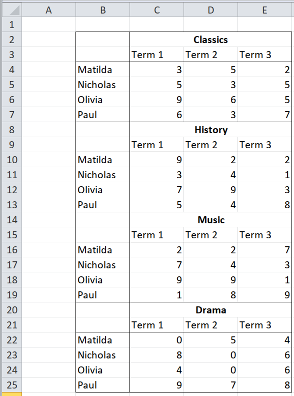

## Complex unpivoting {#pivot-complex}

When `behead()` isn't powerful enough (it makes certain assumptions, and it
doesn't understand formatting), then you can get much more control by using
`enhead()`, which joins together two separate data frames of data cells and
header cells.

This kind of unpivoting is always done in two stages.

1. Identify which cells are headers, and which are data
1. State how the data cells relate to the header cells.

### Two clear rows of text column headers, left-aligned {#2RL}


The first stage, identifying header vs data cells, is simply filtering.

```{r}
path <- system.file("extdata", "worked-examples.xlsx", package = "unpivotr")
all_cells <-
  xlsx_cells(path, sheets = "pivot-annotations") %>%
  dplyr::filter(col >= 4, !is_blank) %>% # Ignore the row headers in this example
  select(row, col, data_type, character, numeric) %>%
  print()

# View the cells in their original positions on the spreadsheet
rectify(all_cells)

first_header_row <-
  dplyr::filter(all_cells, row == 2) %>%
  select(row, col, sex = character)
  # the title of this header is 'sex'
  # the cells are text cells (`"Female"` and `"Male"`) so take the value in the
  # '`character` column.
first_header_row

second_header_row <-
  dplyr::filter(all_cells, row == 3) %>%
  select(row, col, name = character)
  # The title of this header is 'name'.
  # The cells are text cells, so take the value in the '`character` column.
second_header_row

data_cells <-
  dplyr::filter(all_cells, data_type == "numeric") %>%
  select(row, col, score = numeric)
  # The data is exam scores in certain subjects, so give the data that title.
  # The data is numeric, so select only that 'value'.  If some of the data was
  # also text or true/false, then you would select the `character` and `logical`
  # columns as well as `numeric`
```

The second stage is to declare how the data cells relate to each row of column
headers.  Unpivotr provides a set of functions for this, derived from the points
of the compass.

Starting from the point of view of a data cell, the relevant column header from
the second row of headers is the one directly north (up), or `"N"`.

```{r}
enhead(data_cells, second_header_row, "N")
```

The first row of headers, from the point of view of a data cell, is either
directly north (up), or north and west (up and left), or `"NNW"`.

```{r}
enhead(data_cells, first_header_row, "NNW")
```

Piping everything together, we get a complete, tidy dataset, and can finally
drop the `row` and `col` columns.

```{r}
data_cells %>%
  enhead(first_header_row, "NNW") %>%
  enhead(second_header_row, "N") %>%
  select(-row, -col)
```

### Two clear columns of text row headers, top-aligned


This is almost the same as [Two clear rows of text column headers,
left-aligned](2RL), but with different compass directions: `"W"` for directly
west (left), and `"WNW"` for west and north (left and up).

(`"NNW"` and `"WNW"` look like synonyms.  They happen to be synonyms in
`enhead()`, but they aren't in `behead()`.

In this example, the table has no column headers, only row headers.  This is
artificial here, but sometimes table are deliberately laid out in transpose
form: the first column contains the headers, and the data extends in columns
from left to right instead of from top to bottom.

```{r}
path <- system.file("extdata", "worked-examples.xlsx", package = "unpivotr")
all_cells <-
  xlsx_cells(path, sheets = "pivot-annotations") %>%
  dplyr::filter(row >= 3, !is_blank) %>% # Ignore the column headers in this example
  select(row, col, data_type, character, numeric) %>%
  print()

# View the cells in their original positions on the spreadsheet
rectify(all_cells)

first_header_col <-
  dplyr::filter(all_cells, col == 2) %>%
  select(row, col, field = character)
  # the title of this header is 'field', meaning 'group of subjects'.
  # The cells are text cells (`"Humanities"`, `"Performance"`) so take the value
  # in the '`character` column.
first_header_col

second_header_col <-
  dplyr::filter(all_cells, col == 3) %>%
  select(row, col, subject = character)
  # The title of this header is 'subject'
  # The cells are text cells (`"history"`, etc.) so take the value in the
  # '`character` column.
second_header_col

data_cells <-
  dplyr::filter(all_cells, data_type == "numeric") %>%
  select(row, col, score = numeric)
  # The data is examp scores in certain subjects, so give the data that title.
  # The data is numeric, so select only that 'value'.  If some of the data was
  # also text or true/false, then you would select the `character` and `logical`
  # columns as well as `numeric`

data_cells %>%
  enhead(first_header_col, "WNW") %>%
  enhead(second_header_col, "W") %>%
  select(-row, -col)
```

### Two clear rows and columns of text headers, top-aligned and left-aligned


This is a combination of the previous two sections.  No new techniques are used.

1. Identify which cells are headers, and which are data
1. State how the data cells relate to the header cells.

```{r}
path <- system.file("extdata", "worked-examples.xlsx", package = "unpivotr")
all_cells <-
  xlsx_cells(path, sheets = "pivot-annotations") %>%
  dplyr::filter(!is_blank) %>%
  select(row, col, data_type, character, numeric) %>%
  print()

# View the cells in their original positions on the spreadsheet
rectify(all_cells)

first_header_row <-
  dplyr::filter(all_cells, row == 2) %>%
  select(row, col, sex = character)
  # the title of this header is 'sex'
  # the cells are text cells (`"Female"` and `"Male"`) so take the value in the
  # '`character` column.
first_header_row

second_header_row <-
  dplyr::filter(all_cells, row == 3) %>%
  select(row, col, name = character)
  # The title of this header is 'name'.
  # The cells are text cells, so take the value in the '`character` column.
second_header_row

first_header_col <-
  dplyr::filter(all_cells, col == 2) %>%
  select(row, col, field = character)
  # the title of this header is 'field', meaning 'group of subjects'.
  # The cells are text cells (`"Humanities"`, `"Performance"`) so take the value
  # in the '`character` column.
first_header_col

second_header_col <-
  dplyr::filter(all_cells, col == 3) %>%
  select(row, col, subject = character)
  # The title of this header is 'subject'
  # The cells are text cells (`"history"`, etc.) so take the value in the
  # '`character` column.
second_header_col

data_cells <-
  dplyr::filter(all_cells, data_type == "numeric") %>%
  select(row, col, score = numeric)
  # The data is examp scores in certain subjects, so give the data that title.
  # The data is numeric, so select only that 'value'.  If some of the data was
  # also text or true/false, then you would select the `character` and `logical`
  # columns as well as `numeric`

data_cells %>%
  enhead(first_header_row, "NNW") %>%
  enhead(second_header_row, "N") %>%
  enhead(first_header_col, "WNW") %>%
  enhead(second_header_col, "W") %>%
  select(-row, -col)
```

### Centre-aligned headers



Headers aren't always aligned to one side of the data cells that they describe.

```{r}
path <- system.file("extdata", "worked-examples.xlsx", package = "unpivotr")
all_cells <- xlsx_cells(path, sheets = "pivot-centre-aligned")
rectify(all_cells)
```

Looking at that table, it's not immediately obvious where the boundary between
`Female` and `Male` falls, or between `Humanities` and `Performance`.  A naive
approach would be to match the inner headers to the outer ones by proximity, and
there are four directions to do so: `"ABOVE"`, `"LEFT"`, `"BELOW"`, and
`"RIGHT"`.

But in this case, those directions are too naive.

* `Languages` is closest to the `Performance` header, but is a humanity.
* `Lenny` is the same distance from `Female` as from `Male`.

You can fix this by justifying the header cells towards one side of the data
cells that they describe, and then use a direction like `"NNW"` as usual.  Do
this with `justify()`, providing the header cells with a second set of cells
at the positions you want the header cells to move to.

* `header_cells` is the cells whose value will be used as the header
* `corner_cells` is the cells whose position is in one corner of the domain of
  the header (e.g. the top-left-hand corner).

In the original spreadsheet, the borders mark the boundaries.  So the corner
cells of the headers can be found by filtering for cells with a particular
border.

```{r}
all_cells <-
  xlsx_cells(path, sheets = "pivot-centre-aligned") %>%
  select(row, col, is_blank, data_type, character, numeric, local_format_id)

formats <- xlsx_formats(path)
top_borders <- which(!is.na(formats$local$border$top$style))
left_borders <- which(!is.na(formats$local$border$left$style))

first_header_row_corners <-
  dplyr::filter(all_cells, row == 2, local_format_id %in% left_borders) %>%
  select(row, col)
first_header_row_corners

first_header_col_corners <-
  dplyr::filter(all_cells, col == 2, local_format_id %in% top_borders) %>%
  select(row, col)
first_header_col_corners
```

Next, get the first row and first column of header cells as usual.

```{r}
first_header_row <-
  dplyr::filter(all_cells, !is_blank, row == 2) %>%
  select(row, col, sex = character)
  # the title of this header is 'sex'
  # the cells are text cells (`"Female"` and `"Male"`) so take the value in the
  # '`character` column.
first_header_row

first_header_col <-
  dplyr::filter(all_cells, !is_blank, col == 2) %>%
  select(row, col, field = character)
  # the title of this header is 'field', meaning 'group of subjects'.
  # The cells are text cells (`"Humanities"`, `"Performance"`) so take the value
  # in the '`character` column.
first_header_col
```

And now justify the header cells to the same positions as the corner cells.

```{r}
first_header_row <- justify(first_header_row, first_header_row_corners)
first_header_col <- justify(first_header_col, first_header_col_corners)

first_header_row
first_header_col
```

The rest of this example is the same as "Two clear rows and columns of text
headers, top-aligned and left-aligned".

```{r}
second_header_row <-
  dplyr::filter(all_cells, row == 3) %>%
  select(row, col, name = character)
  # The title of this header is 'name'.
  # The cells are text cells, so take the value in the '`character` column.
second_header_row

second_header_col <-
  dplyr::filter(all_cells, col == 3) %>%
  select(row, col, subject = character)
  # The title of this header is 'subject'
  # The cells are text cells (`"history"`, etc.) so take the value in the
  # '`character` column.
second_header_col

data_cells <-
  dplyr::filter(all_cells, data_type == "numeric") %>%
  select(row, col, score = numeric)
  # The data is examp scores in certain subjects, so give the data that title.
  # The data is numeric, so select only that 'value'.  If some of the data was
  # also text or true/false, then you would select the `character` and `logical`
  # columns as well as `numeric`

data_cells %>%
  enhead(first_header_row, "NNW") %>%
  enhead(second_header_row, "N") %>%
  enhead(first_header_col, "WNW") %>%
  enhead(second_header_col, "W") %>%
  select(-row, -col)
```

### Multiple rows or columns of headers, with meaningful formatting


This is a combination of the previous section with [Meaningfully formatted
cells](tidy-formatted-cells).  The section [Meaningfully formatted
rows](tidy-formatted-rows) doesn't work here, because the unpivoting of multiple
rows/columns of headers complicates the relationship between the data and the
formatting.

1. Unpivot the multiple rows/columns of headers, as above, but keep the `row`
   and `col` of each data cell.
1. Collect the `row`, `col` and formatting of each data cell.
1. Join the data to the formatting by the `row` and `col`.

```{r}
path <- system.file("extdata", "worked-examples.xlsx", package = "unpivotr")
all_cells <-
  xlsx_cells(path, sheets = "pivot-annotations") %>%
  dplyr::filter(!is_blank) %>%
  select(row, col, data_type, character, numeric) %>%
  print()

# View the cells in their original positions on the spreadsheet
rectify(all_cells)

first_header_row <-
  dplyr::filter(all_cells, row == 2) %>%
  select(row, col, sex = character)
  # the title of this header is 'sex'
  # the cells are text cells (`"Female"` and `"Male"`) so take the value in the
  # '`character` column.
first_header_row

second_header_row <-
  dplyr::filter(all_cells, row == 3) %>%
  select(row, col, name = character)
  # The title of this header is 'name'.
  # The cells are text cells, so take the value in the '`character` column.
second_header_row

first_header_col <-
  dplyr::filter(all_cells, col == 2) %>%
  select(row, col, field = character)
  # the title of this header is 'field', meaning 'group of subjects'.
  # The cells are text cells (`"Humanities"`, `"Performance"`) so take the value
  # in the '`character` column.
first_header_col

second_header_col <-
  dplyr::filter(all_cells, col == 3) %>%
  select(row, col, subject = character)
  # The title of this header is 'subject'
  # The cells are text cells (`"history"`, etc.) so take the value in the
  # '`character` column.
second_header_col

data_cells <-
  dplyr::filter(all_cells, data_type == "numeric") %>%
  select(row, col, score = numeric)
  # The data is exam scores in certain subjects, so give the data that title.
  # The data is numeric, so select only that 'value'.  If some of the data was
  # also text or true/false, then you would select the `character` and `logical`
  # columns as well as `numeric`

unpivoted <-
  data_cells %>%
  enhead(first_header_row, "NNW") %>%
  enhead(second_header_row, "N") %>%
  enhead(first_header_col, "WNW") %>%
  enhead(second_header_col, "W")
  # Don't delet the `row` and `col` columns yet, because we need them to join on
  # the formatting

# `formats` is a pallette of fill colours that can be indexed by the
# `local_format_id` of a given cell to get the fill colour of that cell
fill_colours <- xlsx_formats(path)$local$fill$patternFill$fgColor$rgb

# Import all the cells, filter out the header row, filter for the first column,
# and create a new column `approximate` based on the fill colours, by looking up
# the local_format_id of each cell in the `formats` pallette.
annotations <-
  xlsx_cells(path, sheets = "pivot-annotations") %>%
  dplyr::filter(row >= 4, col >= 4) %>% # Omit the headers
  mutate(fill_colour = fill_colours[local_format_id]) %>%
  select(row, col, fill_colour)
annotations

left_join(unpivoted, annotations, by = c("row", "col")) %>%
  select(-row, -col)
```

### Mixed headers and notes in the same row/column, distinguished by formatting



This doesn't use any new techniques.  The trick is, when selecting a row or
column of header cells, to filter out ones that have the 'wrong' formatting
(formatting that shows they aren't really headers).  In this example, cells with
italic or red text aren't headers, even if they are in amongst header cells.

First, identify the IDs of formats that have italic or red text.

```{r}
path <- system.file("extdata", "worked-examples.xlsx", package = "unpivotr")
formats <- xlsx_formats(path)

italic <- which(formats$local$font$italic)

# For 'red' we can either look for the RGB code for red "FFFF0000"
red <- which(formats$local$font$color$rgb == "FFFF0000")
red

# Or we can find out what that code is by starting from a cell that we know is
# red.
red_cell_format_id <-
  xlsx_cells(path, sheets = "pivot-notes") %>%
  dplyr::filter(row == 5, col == 2) %>%
  pull(local_format_id)
red_cell_format_id
red_rgb <- formats$local$font$color$rgb[red_cell_format_id]
red <- which(formats$local$font$color$rgb == red_rgb)
red
```

Now we select the headers, filtering out cells with the format IDs of red or
italic cells.

```{r}
all_cells <-
  xlsx_cells(path, sheets = "pivot-notes") %>%
  dplyr::filter(!is_blank) %>%
  select(row, col, character, numeric, local_format_id) %>%
  print()

first_header_row <-
  dplyr::filter(all_cells, row == 2, !(local_format_id %in% c(red, italic))) %>%
  select(row, col, sex = character)
  # the title of this header is 'sex'
  # the cells are text cells (`"Female"` and `"Male"`) so take the value in the
  # '`character` column.
first_header_row

first_header_col <-
  dplyr::filter(all_cells, col == 2, !(local_format_id %in% c(red, italic))) %>%
  select(row, col, qualification = character)
  # the title of this header is 'field', meaning 'group of subjects'.
  # The cells are text cells (`"Humanities"`, `"Performance"`) so take the value
  # in the '`character` column.
first_header_col

second_header_col <-
  dplyr::filter(all_cells, col == 3) %>%
  select(row, col, subject = character)
  # The title of this header is 'subject'
  # The cells are text cells (`"history"`, etc.) so take the value in the
  # '`character` column.

data_cells %>%
  enhead(first_header_row, "NNW") %>%
  enhead(first_header_col, "WNW") %>%
  select(-row, -col)
```

### Mixed levels of headers in the same row/column, distinguished by formatting


Normally different levels of headers are in different rows, or different
columns, like [Two clear rows of text column headers, left-aligned](2Rl).  But
sometimes they coexist in the same row or column, and are distinguishable by
formatting, e.g. bold for the top level, italic for the mid level, and plain for
the lowest level.

In this example, there is a single column of row headers, where the levels are
shown by different amounts of indentation.  The indentation is done by
formatting, rather than by leading spaces or tabs.

The first step is to find the format IDs of all the different levels of
indentation.

```{r}
path <- system.file("extdata", "worked-examples.xlsx", package = "unpivotr")
formats <- xlsx_formats(path)

indent0 <- which(formats$local$alignment$indent == 0)
indent1 <- which(formats$local$alignment$indent == 1)

indent0
indent1
```

Now we use these format IDs to indentify the different levels of headers in the
first column.

```{r}
all_cells <-
  xlsx_cells(path, sheets = "pivot-hierarchy") %>%
  dplyr::filter(!is_blank) %>%
  select(row, col, data_type, character, numeric, local_format_id) %>%
  print()

field <-
  dplyr::filter(all_cells, col == 2, local_format_id %in% indent0) %>%
  select(row, col, field = character)
  # the title of this header is 'field', meaning 'group of subjects'.
  # The cells are text cells (`"Humanities"`, `"Performance"`) so take the value
  # in the '`character` column.
field

subject <-
  dplyr::filter(all_cells, col == 2, local_format_id %in% indent1) %>%
  select(row, col, subject = character)
  # The title of this header is 'subject'
  # The cells are text cells (`"history"`, etc.) so take the value in the
  # '`character` column.
subject

name <-
  dplyr::filter(all_cells, row == 2) %>%
  select(row, col, name = character)
  # The title of this header is 'name'.
  # The cells are text cells, so take the value in the '`character` column.
name

data_cells <-
  dplyr::filter(all_cells, data_type == "numeric") %>%
  select(row, col, score = numeric)
  # The data is exam scores in certain subjects, so give the data that title.
  # The data is numeric, so select only that 'value'.  If some of the data was
  # also text or true/false, then you would select the `character` and `logical`
  # columns as well as `numeric`

data_cells %>%
  enhead(field, "WNW") %>%
  enhead(subject, "W") %>%
  enhead(name, "N") %>%
  select(-row, -col)
```

### Repeated rows/columns of headers within the table



Repetitions can simply be ignored.  Select one of the sets of headers, and use
it for all the data.  In this example, the data cells are easy to distinguish
from the headers mixed in among them, because only the data cells have the
`numeric` data type.

```{r}
path <- system.file("extdata", "worked-examples.xlsx", package = "unpivotr")
all_cells <-
  xlsx_cells(path, sheets = "pivot-repeated-headers") %>%
  dplyr::filter(!is_blank) %>%
  select(row, col, data_type, character, numeric) %>%
  print()

# View the cells in their original positions on the spreadsheet
rectify(all_cells)

# The 'term' headers appear four times, but only the first one is needed.
term <-
  dplyr::filter(all_cells, row == 2) %>%
  select(row, col, term = character)
  # the title of this header is 'field', meaning 'group of subjects'.
  # The cells are text cells (`"Humanities"`, `"Performance"`) so take the value
  # in the '`character` column.
term

subject <-
  dplyr::filter(all_cells, col == 2) %>%
  select(row, col, subject = character)
  # The title of this header is 'subject'
  # The cells are text cells (`"history"`, etc.) so take the value in the
  # '`character` column.
subject

name <-
  dplyr::filter(all_cells, col == 3) %>%
  select(row, col, name = character)
  # The title of this header is 'name'.
  # The cells are text cells, so take the value in the '`character` column.
name

# The data cells are distinguished from the 'term' headers by their data type --
# the data cells are numeric, whereas the term headers are character.
data_cells <-
  dplyr::filter(all_cells, data_type == "numeric") %>%
  select(row, col, score = numeric)
  # The data is exam scores in certain subjects, so give the data that title.
  # The data is numeric, so select only that 'value'.  If some of the data was
  # also text or true/false, then you would select the `character` and `logical`
  # columns as well as `numeric`
data_cells

data_cells %>%
  enhead(term, "N") %>%
  enhead(subject, "NNW") %>%
  enhead(name, "W") %>%
  select(-row, -col)
```

### Headers amongst the data



This happens when what is actually a row-header, instead of being presented to
the left of the data, is presented above the data.  (Alternatively, what is
actually a column header, instead of being presented above the data, is
presented to the side.)

The way to handle it is to *pretend* that it is a row header, and use the
`"WNW"` direction as normal.

```{r}
path <- system.file("extdata", "worked-examples.xlsx", package = "unpivotr")
all_cells <-
  xlsx_cells(path, sheets = "pivot-header-within-data") %>%
  dplyr::filter(!is_blank) %>%
  select(row, col, data_type, character, numeric, local_format_id) %>%
  print()

# View the cells in their original positions on the spreadsheet
rectify(all_cells)

bold <- which(xlsx_formats(path)$local$font$bold)

# The subject headers, though mixed with the data and the 'term' headers, are
# distinguishable by the data type "character" and by being bold.
subject <-
  dplyr::filter(all_cells,
         col == 3,
         data_type == "character",
         local_format_id %in% bold) %>%
  select(row, col, subject = character)
  # The title of this header is 'subject'
  # The cells are text cells (`"history"`, etc.) so take the value in the
  # '`character` column.
subject

# We only need one set of the 'term' headers
term <-
  dplyr::filter(all_cells, row == 3, data_type == "character") %>%
  select(row, col, term = character)
  # the title of this header is 'field', meaning 'group of subjects'.
  # The cells are text cells (`"Humanities"`, `"Performance"`) so take the value
  # in the '`character` column.
term

name <-
  dplyr::filter(all_cells, col == 2) %>%
  select(row, col, name = character)
  # The title of this header is 'name'.
  # The cells are text cells, so take the value in the '`character` column.
name

# The data cells are distinguished from the 'subject' headers by their data
# type -- the data cells are numeric, whereas the term headers are character.
data_cells <-
  dplyr::filter(all_cells, data_type == "numeric") %>%
  select(row, col, score = numeric)
  # The data is exam scores in certain subjects, so give the data that title.
  # The data is numeric, so select only that 'value'.  If some of the data was
  # also text or true/false, then you would select the `character` and `logical`
  # columns as well as `numeric`
data_cells

data_cells %>%
  enhead(subject, "WNW") %>%
  enhead(term, "N") %>%
  enhead(name, "W") %>%
  select(-row, -col)
```

