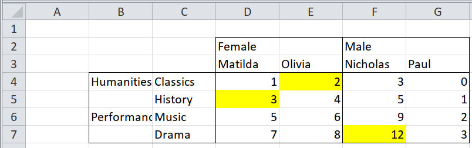

## Simple unpivoting {#pivot-simple}

The `behead()` function takes one level of headers from a pivot table and makes
it part of the data.  Think of it like `tidyr::gather()`, except that it works
when there is more than one row of headers (or more than one column of
row-headers), and it only works on tables that have first come through
`tidy_table()` or `tidyxl::xlsx_cells()`.

### Two clear rows of text column headers, left-aligned



Here we have a pivot table with two rows of column headers.  The first row of
headers is left-aligned, so `"Female"` applies to the first two columns of data,
and `"Male"` applies to the next two.  The second row of headers has a header in
every column.

```{r}
path <- system.file("extdata", "worked-examples.xlsx", package = "unpivotr")
all_cells <-
  xlsx_cells(path, sheets = "pivot-annotations") %>%
  filter(col >= 4, !is_blank) %>% # Ignore the row headers in this example
  select(row, col, data_type, character, numeric)
all_cells
```

The `behead()` function takes the 'melted' output of `tidy_table()`,
`tidyxl::xlsx_cells()`, or a previous `behead()`, and three more arguments to
specify how the header cells relate to the data cells.

The outermost header is the top row, `"Female" NA "Male" NA`.  The `"Female"`
and `"Male"` headers are above and to-the-left-of the data cells.  We express
this as a compass direction, north-north-west, or `"NNW"`.  We also give the
headers a name, `sex`, and say which column of `all_cells` contains the value
of the header cells -- it's usually the `character` column.

```{r}
all_cells %>%
  behead("NNW", sex)
```

That did half the job.  The value 2 in row 4 column 5 is indeed a score of a
female. But the value `"matilda"` in row 3 column 4 isn't a population -- it's
another header.  The next step is to strip that second level of column headers.
This time, the compass direction is `"N"`, because the headers are directly
above the associated data cells, and we call it `name`, because it represents
names of people.

```{r}
all_cells %>%
  behead("NNW", sex) %>%
  behead("N", `name`)
```

A final step is a normal clean-up.  We drop the `row`, `col` and `character`
columns, and we rename the `numeric` column to `score`, which is what it
represents.

```{r}
all_cells %>%
  behead("NNW", sex) %>%
  behead("N", `name`) %>%
  select(score = numeric, sex, `name`)
```

### Two clear rows and columns of text headers, top-aligned and left-aligned


There are no new techniques are used, just more compass directions: `"W"` for
headers directly to the left of the data cells, and `"WNW"` for headers
left-and-above the data cells.

```{r}
path <- system.file("extdata", "worked-examples.xlsx", package = "unpivotr")
all_cells <-
  xlsx_cells(path, sheets = "pivot-annotations") %>%
  filter(!is_blank) %>%
  select(row, col, data_type, character, numeric) %>%
  print()

all_cells %>%
  behead("NNW", sex) %>%   # As before
  behead("N", `name`) %>%  # As before
  behead("WNW", field) %>% # Left-and-above
  behead("W", subject) %>% # Directly left
  rename(score = numeric) %>%
  select(-row, -col, -character)
```

### Multiple rows or columns of headers, with meaningful formatting


This is a combination of the previous section with [meaningfully formatted
rows](tidy-formatted-rows).  The section [meaninfully formatted
cells](tidy-formatted-cells) doesn't work here, because the unpivoting of
multiple rows/columns of headers complicates the relationship between the data
and the formatting.

1. Unpivot the multiple rows/columns of headers, as above, but keep the `row`
   and `col` of each data cell.
1. Collect the `row`, `col` and formatting of each data cell.
1. Join the data to the formatting by the `row` and `col`.

```{r}
path <- system.file("extdata", "worked-examples.xlsx", package = "unpivotr")
all_cells <-
  xlsx_cells(path, sheets = "pivot-annotations") %>%
  filter(!is_blank) %>%
  select(row, col, data_type, character, numeric) %>%
  print()

unpivoted <-
  all_cells %>%
  behead("NNW", sex) %>%   # As before
  behead("N", `name`) %>%  # As before
  behead("WNW", field) %>% # Left-and-above
  behead("W", subject) %>% # Directly left
  rename(score = numeric) %>%
  select(-character)                # Retain the row and col for now
unpivoted

# `formats` is a pallette of fill colours that can be indexed by the
# `local_format_id` of a given cell to get the fill colour of that cell
fill_colours <- xlsx_formats(path)$local$fill$patternFill$fgColor$rgb
fill_colours

# Import all the cells, filter out the header row, filter for the first column,
# and create a new column `approximate` based on the fill colours, by looking up
# the local_format_id of each cell in the `formats` pallette.
annotations <-
  xlsx_cells(path, sheets = "pivot-annotations") %>%
  filter(row >= 4, col >= 4) %>% # Omit the headers
  mutate(fill_colour = fill_colours[local_format_id]) %>%
  select(row, col, fill_colour)
annotations

left_join(unpivoted, annotations, by = c("row", "col")) %>%
  select(-row, -col)
```

