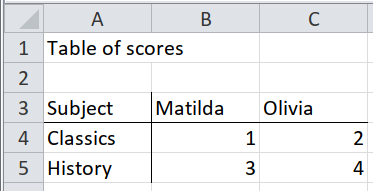
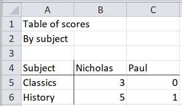
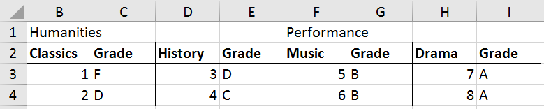

# Small multiples {#small-multiples}

You might have heard the term 'small multiples' in the context of graphs, but it
also occurs in spreadsheets, when an array of small tables could be combined
into a single table.

To import an array of small tables, start by writing the code to import one, and
then apply that to each in turn.

1. Write the code to import one table.
1. Wrap that code in a function.
1. Partition the whole spreadsheet so that each table is in one partition.
1. Map the function over the partitions.

## Small multiples with all headers present for each multiple


The code to import one of these multiples will be simple.

```{r, eval = FALSE}
cells %>%
  behead("NNW", subject) %>%
  behead("N", header) %>%
  select(-col, -local_format_id) %>%
  spatter(header) %>%
  select(-row)
```

The first table is in rows 1 to 4, columns 1 to 3, so we start by writing the
code to import only that table.

```{r}
path <- system.file("extdata", "worked-examples.xlsx", package = "unpivotr")
all_cells <-
  xlsx_cells(path, sheets = "small-multiples") %>%
  dplyr::filter(!is_blank) %>%
  select(row, col, data_type, character, numeric, local_format_id)

table1 <- dplyr::filter(all_cells, row %in% 1:4, col %in% 1:3)

table1 %>%
  behead("NNW", subject) %>%
  behead("N", header) %>%
  select(-col, -local_format_id) %>%
  spatter(header) %>%
  select(-row)
```

We wrap that code in a function, to be applied to each separate table.

```{r}
unpivot <- function(cells) {
  cells %>%
    behead("NNW", subject) %>%
    behead("N", header) %>%
    select(-col, -local_format_id) %>%
    spatter(header) %>%
    select(-row)
}
```

Now we partition the spreadsheet into the separate tables.  This is done by
identifying a corner cell in each table.

```{r}
formats <- xlsx_formats(path)
italic <- which(formats$local$font$italic)

corners <-
  all_cells %>%
  dplyr::filter(local_format_id %in% italic) %>%
  select(row, col)

partitions <- partition(all_cells, corners)
partitions
```

Finally, map the unpivoting function over the partitions, and combine the
results.

```{r}
partitions %>%
  mutate(cells = map(cells, unpivot)) %>%
  unnest() %>%
  select(-corner_row, -corner_col)
```

## Same table in several worksheets/files (using the sheet/file name)


Because `tidyxl()` imports cells from multiple sheets into the same data frame,
tables on separate sheets can be imported by mapping over the different sheets.
Just name each sheet in the `xlsx_cell()` call, or don't name any to import them
all.

As far as `tidyxl()` is concerned, the particular sheet (aka 'tab') that a cell
is on is another coordinate like `row` and `col`, so the full location of a cell
is its `row`, its `col`, and its `sheet`.

```{r}
path <- system.file("extdata", "worked-examples.xlsx", package = "unpivotr")
all_cells <-
  xlsx_cells(path, sheets = c("humanities", "performance")) %>%
  dplyr::filter(!is_blank) %>%
  select(sheet, row, col, data_type, character, numeric)
all_cells
```

To prepare the sheets to be mapped over, use `tidyr::nest()`.  The `data` column
contains the cells of each sheet.

```{r}
all_cells %>%
  nest(-sheet)
```

The function to unpivot each table in this case will be a couple of `behead()`
statements.  Further clean-up can be saved until the end.

```{r}
unpivot <- function(cells) {
  cells %>%
    behead("N", name) %>%
    behead("W", subject)
}
```

After mapping the unpivot function over each sheet of cells, use
`tidyr::unnest()` to show every row of data again.

```{r}
all_cells %>%
  nest(-sheet) %>%
  mutate(data = map(data, unpivot)) %>%
  unnest()
```

Finally, do the clean-up operations that were saved until now.

```{r}
all_cells %>%
  nest(-sheet) %>%
  mutate(data = map(data, unpivot)) %>%
  unnest() %>%
  transmute(field = sheet,
            name,
            subject,
            score = numeric)
```

## Same table in several worksheets/files but in different positions




This is almost the same as the section "Same table in several worksheets/files
(using the sheet/file name)".  The only difference is that the function you
write to unpivot the table must also *find* the table in the first place, and be
robust to differences in the placement and context of the table on each sheet.

In this example, both tables begin in the same column, but there is an extra row
of notes above one of the tables.  There are a few ways to tackle this problem.
Here, we filter for the `Subject` cell, which is either `A3` or `A4`, and then
extend the selection to include the whole table.

```{r}
path <- system.file("extdata", "worked-examples.xlsx", package = "unpivotr")
all_cells <-
  xlsx_cells(path, sheets = c("female", "male")) %>%
  dplyr::filter(!is_blank) %>%
  select(sheet, row, col, data_type, character, numeric)
all_cells

unpivot <- function(cells) {
  cells %>%
    dplyr::filter(character == "Subject") %>%
    pull(row) %>%
    {dplyr::filter(cells, row >= .)} %>%
    behead("N", name) %>%
    behead("W", subject)
}

all_cells %>%
  nest(-sheet) %>%
  mutate(data = map(data, unpivot)) %>%
  unnest() %>%
  select(sex = sheet, name, subject, score = numeric)
```

## Implied multiples

Implied multiples look like a single table, but many of the headers appear more
than once.  There is a dominant set of headers that are on the same 'level'
(e.g. in the same row) as the other headers.



In the example, the header "Grade" is repeated, but it really belongs in
each case to the header "Classics", "History", "Music" or "Drama".  Those
subject headers serve two purposes: as title of each small multiple, and as the
unstated "Score" header of their columns.  The difficulty is in associating a
grade with its corresponding score.

The process is long-winded, but there are only two new ideas:

1. Unpivot the corner cells on their own, with no data.
1. Rename the corner cells to be normal header cells.

TODO: link to `vaccinations` case study.

```{r}
path <- system.file("extdata", "worked-examples.xlsx", package = "unpivotr")
all_cells <-
  xlsx_cells(path, sheets = "implied-multiples") %>%
  dplyr::filter(!is_blank) %>%
  select(row, col, data_type, character, numeric)
```

Unpivot only the corner cells "Classics", "History", etc. to associate them with
their field ("Humanities", "Performance"), and store them in the variable
`corners`.  It feels odd to unpivot only the headers and not the data, but bear
with it.

```{r}
corners <-
  all_cells %>%
  dplyr::filter(col >= 2, row <= 2, character != "Grade") %>%
  behead("NNW", "field") %>%
  dplyr::select(row, col, subject = character, field)
corners
```

Now the cells "Classics" and "History" can both be renamed "score", which is
their function at the head of their columns (rather than labels of the implied
small multiples).

```{r}
cells <-
  all_cells %>%
  dplyr::filter(row >= 2, col >= 2) %>%
  mutate(character = if_else(character == "Grade", character, "score"))
```

Use `corners` to partition the rest of the headers and the data cells.
Notice that the subject and field are mapped to the appropriate partition.

```{r}
partitions <-
  partition(cells, corners, strict = FALSE) %>%
  # `strict = FALSE` because the corners aren't among the cells
  select(-corner_row, corner_col)
partitions
```

Unnest and unpivot the "score" and "grade" headers.

```{r}
partitions <-
  partitions %>%
  unnest() %>%
  behead("N", "header") %>%
  select(-col, -corner_col)
partitions
```

The "Name" row headers can now be joined.

```{r}
name <-
  all_cells %>%
  dplyr::filter(row >= 3, col == 1) %>%
  select(row, name = character)
name

partitions <- inner_join(partitions, name, by = "row")
partitions
```

Finally everything can be spattered into a recognisable table.

```{r}
spatter(partitions, header) %>%
  select(-row)
```

The process is easier to understand when seen as a whole.

```{r}
path <- system.file("extdata", "worked-examples.xlsx", package = "unpivotr")
all_cells <-
  xlsx_cells(path, sheets = "implied-multiples") %>%
  dplyr::filter(!is_blank) %>%
  select(row, col, data_type, character, numeric)

name <-
  all_cells %>%
  dplyr::filter(row >= 3, col == 1) %>%
  select(row, name = character)

# Unpivot the corner cells on their own (no data)
corners <-
  all_cells %>%
  dplyr::filter(col >= 2, row <= 2, character != "Grade") %>%
  behead("NNW", "field") %>%
  dplyr::select(row, col, subject = character, field)

all_cells %>%
  dplyr::filter(row >= 2, col >= 2) %>%
  # Rename the corner cells as normal header cells
  mutate(character = if_else(character == "Grade", character, "score")) %>%
  # Partition by the corner cells, and bring the subject fields with them
  partition(corners, strict = FALSE, nest = FALSE) %>%
  select(-corner_row, corner_col) %>%
  # Do some normal unpivotring
  behead("N", "header") %>%
  select(-col, -corner_col) %>%
  # Attach the row headers
  inner_join(name, by = "row") %>%
  # Present as a normal table
  spatter(header) %>%
  select(-row)
```
