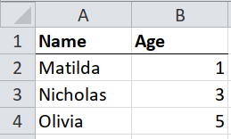
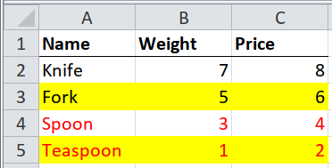
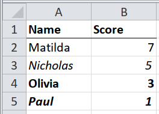
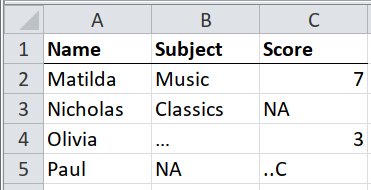

# Tidy-ish tables {#tidyish}

This chapter is a gentle introduction, taking what you already know about
importing tidy tabular data (with `read.csv()` or the
[readr](https://readr.tidyverse.org) package), and showing you how to how to do
the same things with [tidyxl](https://nacnudus.github.io/tidyxl) and
[unpivotr](https://nacnudus.github.io/unpivotr).  It works up to tables that are
mostly tidy, but have subtle problems.

## Clean & tidy tables {#tidy-clean}



If the tables in the spreadsheet are clean and tidy, then you should use a
package like [readxl](https://github.com/tidyverse/readxl).  But it's worth
knowing how to emulate readxl with tidyxl and unpivotr, because some *almost*
clean tables can be handled using these techniques.

Clean and tidy means

* One table per sheet
* A single row of column headers, or no headers
* A single data type in each column
* Only one kind of sentinel value (to be interpreted as `NA`)
* No meaningful formatting
* No data buried in formulas
* No need to refer to named ranges

Here's the full process.

```{r}
path <- system.file("extdata", "worked-examples.xlsx", package = "unpivotr")
xlsx_cells(path, sheet = "clean") %>%
  behead("up", header) %>%
  select(row, data_type, header, character, numeric) %>%
  spatter(header) %>%
  select(-row)
```

`tidyxl::xlsx_cells()` imports the spreadsheet into a data frame, where each row
of the data frame describes one cell of the spreadsheet.  The columns `row` and
`col` (and `address`) describe the position of the cell, and the value of the
cell is in one of the columns `error`, `logical`, `numeric`, `date`,
`character`, depending on the type of data in the cell.  The column `data_type`
says which column the value is in.  Other columns describe formatting and
formulas.

```{r}
path <- system.file("extdata", "worked-examples.xlsx", package = "unpivotr")
xlsx_cells(path, sheet = "clean") %>%
  select(row, col, data_type, character, numeric)
```

`unpivotr::behead()` takes one level of headers from a pivot table and makes it
part of the data.  Think of it like `tidyr::gather()`, except that it works when
there is more than one row of headers (or more than one column of row-headers),
and it only works on tables that have first come through
`unpivotr::as_cells()` or `tidyxl::xlsx_cells()`.

```{r}
xlsx_cells(path, sheet = "clean") %>%
  select(row, col, data_type, character, numeric) %>%
  behead("up", header)
```

`unpivotr::spatter()` spreads key-value pairs across multiple columns, like
`tidyxl::spread()`, except that it handles mixed data types.  It knows which
column contains the cell value (i.e. the `character` column or the `numeric`
column), by checking the `data_type` column.  Just like `tidyr::spread()`, it
can be confused by extraneous data, so it's usually a good idea to drop the
`col` column first, and to keep the `row` column.

```{r}
xlsx_cells(path, sheet = "clean") %>%
  select(row, col, data_type, character, numeric) %>%
  behead("up", header) %>%
  select(-col) %>%
  spatter(header) %>%
  select(-row)
```

In case the table has no column headers, you can spatter the `col` column
instead of a nonexistent `header` column.

```{r}
xlsx_cells(path, sheet = "clean") %>%
  dplyr::filter(row >= 2) %>%
  select(row, col, data_type, character, numeric) %>%
  spatter(col) %>%
  select(-row)
```

Tidyxl and unpivotr are much more complicated than readxl, and that's the point:
tidyxl and unpivotr give you more power and complexity when you need it.

```{r}
read_excel(path, sheet = "clean")
read_excel(path, sheet = "clean", col_names = FALSE, skip = 1)
```

## Almost-tidy tables

For tables that are already 'tidy' (a single row of column headers), use
packages like [readxl](http://readxl.tidyverse.org) that specialise in importing
tidy data.

For everything else, read on.

### Transposed (headers in the first row, data extends to the right)


Most packages for importing data assume that the headers are in the first row,
and each row of data is an observation.  They usually don't support the
alternative: headers in the first column, and each column of data is an
observation.

You can hack a way around this by importing without recognising any headers,
transposing with `t()` (which outputs a matrix), placing the headers as names,
and converting back to a data frame, but this almost always results in all the
data types being converted.

```{r}
path <- system.file("extdata", "worked-examples.xlsx", package = "unpivotr")
read_excel(path, sheet = "transposed", col_names = FALSE) %>%
  t() %>%
  `colnames<-`(.[1, ]) %>%
  .[-1, ] %>%
  as_tibble()
```

Tidyxl and unpivotr are agnostic to the layout of tables.  Importing the
transpose is the same is importing the usual layout, merely using the `"left"`
direction instead of `"up"` when beheading the headers.

```{r}
xlsx_cells(path, sheet = "transposed") %>%
  behead("left", header) %>%
  select(col, data_type, header, character, numeric) %>%
  spatter(header) %>%
  select(Name, Age)
```

### Other stuff on the same sheet


It will be more complicated when the table doesn't begin in cell A1, or if there
are non-blank cells above, below or either side of the table.

If you know at coding time which rows and columns the table occupies, then you
can do the following.

* Blank or non-blank cells above the table: use the `skip` argument of
    `readxl::read_excel()`.
* Blank or non-blank cells either side of the table: use the `col_types`
  argument of `readxl::read_excel()` to ignore those columns.
* Blank or non-blank cells below the table: use `n_max`
  argument of `readxl::read_excel()` to ignore those rows.

```{r}
path <- system.file("extdata", "worked-examples.xlsx", package = "unpivotr")
readxl::read_excel(path,
                   sheet = "notes",
                   skip = 2,
                   n_max = 33,
                   col_types = c("guess", "guess", "skip")) %>%
  drop_na()
```

If you don't know at coding time which rows and columns the table occupies (e.g.
when the latest version of the spreadsheet is published and the table has
moved), then one strategy is to read the spreadsheet with `tidyxl::xlsx_cells()`
first, and inspect the results to determine the boundaries of the table.  Then
use those boundaries as the `skip`, `n_max` and `col_types` arguments to
`readxl::read_excel()`

1. Read the spreadsheet with `tidyxl::xlsx_cells()`.  Filter the result for
   sentinel values, e.g. the cells containing the first and final column
   headers, and a cell in the final row of data.
2. Construct the arguments `skip`, `n_max` and `col_types` so that
   `readxl::read_excel()` gets the exact dimensions of the table.

```{r}
# Step 1: read the spreadsheet and filter for sentinel values to detect the
# top-left and bottom-right cells
cells <- xlsx_cells(path, sheet = "notes")
rectify(cells)

top_left <-
  dplyr::filter(cells, character == "Name") %>%
  select(row, col)
top_left

# It can be tricky to find the bottom-right cell because you have to make some
# assumptions.  Here we assume that only cells within the table are numeric.
bottom_right <-
  dplyr::filter(cells, data_type == "numeric") %>%
  summarise(row = max(row), col = max(col))
bottom_right

# Step 2: construct the arguments `skip` and `n_max` for read_excel()
skip <- top_left$row - 1L
n_rows <- bottom_right$row - skip

read_excel(path, sheet = "notes", skip = skip, n_max = n_rows)
```

Here's another way using only tidyxl and unpivotr.

```{r}
# Step 2: filter for cells between the top-left and bottom-right, and spatter
# into a table
cells %>%
  dplyr::filter(between(row, top_left$row, bottom_right$row),
         between(col, top_left$col, bottom_right$col)) %>%
  select(row, col, data_type, character, numeric) %>%
  behead("up", header) %>%
  select(-col) %>%
  spatter(header) %>%
  select(-row)
```

## Meaningfully formatted rows {#tidy-formatted-rows}


As with [clean, tidy tables](clean), but with a second step to interpret the
formatting.

Sometimes whole rows in a table are highlighted by formatting them with, say, a
bright yellow fill.  The highlighting could mean "this observation should be
ignored", or "this product is no longer available".  Different colours could
mean different levels of a hierarchy, e.g. green for "pass" and red for "fail".

There are three steps to interpreting this.

1. Import the table, taking only the cell values and ignoring the formatting.
1. Import one column of the table, taking only the formatting and not the cell
   values.
1. Use `dplyr::bind_cols()` to append the column of formatting to the table of
   cell values.  You can then interpret the formatting however you like.

Step 1 is the same as [clean, tidy tables](clean).

Step 2 uses `tidyxl::xlsx_cells()` to load the data, `tidyxl::xlsx_formats()`,
and several tidyverse functions to link the two and filter for only one column.
Why only one column?  Because if a whole row is highlighted, then you only need
to know the highlighting of one column to know the highlighting of all the
others.

This is a special case of the following section, [meaningfully formatted
cells](tidy-formatted-cells). Here `dplyr::bind_cols()` can be used as a
shortcut, because we are joining exactly `n` rows of formatting to `n` rows of
data.  The following sections is a more general case that can be used instead of
this procedure.

```{r}
# Step 1: import the table taking only cell values and ignoring the formatting
path <- system.file("extdata", "worked-examples.xlsx", package = "unpivotr")
x <- read_excel(path, sheet = "highlights")

# Step 2: import one column of the table, taking only the formatting and not the
# cell values

# `formats` is a pallette of fill colours that can be indexed by the
# `local_format_id` of a given cell to get the fill colour of that cell
fill_colours <- xlsx_formats(path)$local$fill$patternFill$fgColor$rgb

# Import all the cells, filter out the header row, filter for the first column,
# and create a new column `fill_colour` of the fill colours, by looking up the
# local_format_id of each cell in the `fill_colours` pallette.
fills <-
  xlsx_cells(path, sheet = "highlights") %>%
  dplyr::filter(row >= 2, col == 1) %>% # Omit the header row
  mutate(fill_colour = fill_colours[local_format_id]) %>%
  select(fill_colour)

# Step 3: append the `fill` column to the rest of the data
bind_cols(x, fills) %>%
  select(Age, Height, fill_colour)
```

Note that the fill colour is expressed as an RGB value with transparency in the
first two letters, e.g. `FFFFFF00` is `FF` (opaque), with `FFFF00` (yellow).

Here's another way using only tidyxl and unpivotr.

```{r}
fill_colours <- xlsx_formats(path)$local$fill$patternFill$fgColor$rgb

xlsx_cells(path, sheet = "highlights") %>%
  mutate(fill_colour = fill_colours[local_format_id]) %>%
  select(row, col, data_type, character, numeric, fill_colour) %>%
  behead("up", header) %>%
  select(-col, -character) %>%
  spatter(header) %>%
  select(-row)
```

## Meaningfully formatted cells {#tidy-formatted-cells}


If single cells are highlighted, rather than whole rows, then the highlights
probably indicate something about the column rather than the row.  For example,
a highlighted cell in a column called "age" of a table of medical patients,
might mean "the age of this patient is uncertain".

One way to deal with this is to create a new column in the final table for each
column in the original that has any highlighted cells.  For example, if
highlighted cells mean "this value is uncertain", and some cells in the `age`
and `height` columns are highlighted, then you could create two new columns:
`uncertain_age`, and `uncertain_height`, by following the procedure of
[meaningfully formatted rows](tidy-formatted-rows) for each column `age` and
`height`.

```{r}
# Step 1: import the table taking only cell values and ignoring the formatting
path <- system.file("extdata", "worked-examples.xlsx", package = "unpivotr")
x <- read_excel(path, sheet = "annotations")

# Step 2: import one column of the table, taking only the formatting and not the
# cell values

# `formats` is a pallette of fill colours that can be indexed by the
# `local_format_id` of a given cell to get the fill colour of that cell
fill_colours <- xlsx_formats(path)$local$fill$patternFill$fgColor$rgb

# Import all the cells, filter out the header row, filter for the first column,
# and create new columns `something_fill` of the fill colours, by looking up the
# local_format_id of each cell in the `formats` pallette.
fills <-
  xlsx_cells(path, sheet = "annotations") %>%
  dplyr::filter(row >= 2, col >= 2) %>% # Omit the header row and name column
  mutate(fill_colour = fill_colours[local_format_id]) %>%
  select(row, col, fill_colour) %>%
  spread(col, fill_colour) %>%
  select(-row) %>%
  set_names(paste0(colnames(x)[-1], "_fill"))
fills

# Step 3: append the `fill` column to the rest of the data
bind_cols(x, fills)
```

Here's the same thing, but using only tidyxl and unpivotr

```{r}
fill_colours <- xlsx_formats(path)$local$fill$patternFill$fgColor$rgb

cells <-
  xlsx_cells(path, sheet = "annotations") %>%
  mutate(fill_colour = fill_colours[local_format_id]) %>%
  select(row, col, data_type, character, numeric, fill_colour)
cells

values <-
  cells %>%
  select(-fill_colour) %>%
  behead("up", header) %>%
  select(-col) %>%
  spatter(header)
values

fills <-
  cells %>%
  behead("up", header) %>%
  mutate(header = paste0(header, "_fill")) %>%
  select(row, header, fill_colour) %>%
  spread(header, fill_colour)
fills

left_join(values, fills, by = "row") %>%
  select(-row)
```

Another way would be to make the table what I call "extra-tidy".  If it is tidy,
then each row is an observation, and each column is a variable.  To make it
"extra-tidy", you `gather()` the variables so that each row is *one observation
of one variable*.  This works best when every variable has the same data type,
otherwise the values will be coerced, probably to a character.

```{r}
# Tidy
(x <- read_excel(path, sheet = "annotations"))

# Extra-tidy
extra_tidy <-
  x %>%
  gather(variable, value, -Name) %>%
  arrange(Name, variable)
extra_tidy
```

With an extra-tidy dataset, the formatting can now be appended to the values of
individual variables, rather than to whole observations.

```{r}
# Extra-tidy, with row and column numbers of the original variables
extra_tidy <-
  read_excel(path, sheet = "annotations") %>%
  mutate(row = row_number() + 1L) %>%
  gather(variable, value, -row, -Name) %>%
  group_by(row) %>%
  mutate(col = row_number() + 1L) %>%
  ungroup() %>%
  select(row, col, Name, variable, value) %>%
  arrange(row, col)
extra_tidy

# `formats` is a pallette of fill colours that can be indexed by the
# `local_format_id` of a given cell to get the fill colour of that cell
fill_colours <- xlsx_formats(path)$local$fill$patternFill$fgColor$rgb

# Import all the cells, filter out the header row, filter for the first column,
# and create a new column `uncertain` based on the fill colours, by looking up
# the local_format_id of each cell in the `formats` pallette.
fills <-
  xlsx_cells(path, sheet = "annotations") %>%
  dplyr::filter(row >= 2, col >= 2) %>% # Omit the header row and name column
  mutate(fill_colour = fill_colours[local_format_id]) %>%
  select(row, col, fill_colour)
fills

# Step 3: append the `fill` column to the rest of the data
left_join(extra_tidy, fills, by = c("row", "col"))
```

Here's the same extra-tidy version, but using only tidyxl and unpivotr.

```{r}
fill_colours <- xlsx_formats(path)$local$fill$patternFill$fgColor$rgb

xlsx_cells(path, sheet = "annotations") %>%
  mutate(fill_colour = fill_colours[local_format_id]) %>%
  select(row, col, data_type, character, numeric, fill_colour) %>%
  behead("left", Name) %>%
  behead("up", variable) %>%
  select(-data_type, -character, value = numeric)
```

## Layered meaningful formatting {#layered-formatting}



Sometimes different kinds of formatting relate to clearly different aspects of
an observation, e.g. yellow highlight for "uncertain data" and red text for
"product no longer available".  Both yellow highlighting and red text in the
same row would indicate uncertain data and unavailability of the product at the
same time.

Deal with it by reading each kind of formatting into a separate column, e.g.
fill colour into one column, font colour into another, bold/not-bold into a
another, etc.

```{r}
# Step 1: import the table taking only cell values and ignoring the formatting
path <- system.file("extdata", "worked-examples.xlsx", package = "unpivotr")
x <- read_excel(path, sheet = "combined-highlights")

# Step 2: import one kind of formatting of one column of the table

# `formats` is a pallette of fill colours that can be indexed by the
# `local_format_id` of a given cell to get the fill colour of that cell
fill_colours <- xlsx_formats(path)$local$fill$patternFill$fgColor$rgb
font_colours <- xlsx_formats(path)$local$font$color$rgb

# Import all the cells, filter out the header row, filter for the first column,
# and create a new column `fill` of the fill colours, by looking up the
# local_format_id of each cell in the `formats` pallette.
formats <-
  xlsx_cells(path, sheet = "combined-highlights") %>%
  dplyr::filter(row >= 2, col == 1) %>% # Omit the header row
  mutate(fill_colour = fill_colours[local_format_id],
         font_colour = font_colours[local_format_id]) %>%
  select(fill_colour, font_colour)

# Step 3: append the `fill` column to the rest of the data
bind_cols(x, formats)
```

Here's the same thing, but using only tidyxl and unpivotr.

```{r}
fill_colours <- xlsx_formats(path)$local$fill$patternFill$fgColor$rgb
font_colours <- xlsx_formats(path)$local$font$color$rgb

cells <-
  xlsx_cells(path, sheet = "combined-highlights") %>%
  mutate(fill_colour = fill_colours[local_format_id],
         font_colour = font_colours[local_format_id]) %>%
  select(row, col, data_type, character, numeric, fill_colour, font_colour) %>%
  behead("up", header) %>%
  behead("left", Name) %>%
  select(-col, -character)

values <-
  cells %>%
  select(-fill_colour, -font_colour) %>%
  spread(header, numeric)

formats <- distinct(cells, row, fill_colour, font_colour)

left_join(values, formats, by = "row") %>%
  select(-row)
```

## Hierarchies in formatting



Different kinds of formatting might also represent different levels of a
hierarchy, e.g.

| formatting    | interpretation |
|:--------------|:---------------|
| none          | good           |
| italic        | satisfactory   |
| bold          | poor           |
| bold & italic | fail           |

When each kind of formatting relates to a different level of one hierarchy,
import the different kinds of formatting into different columns, and then
combine them into a third column, perhaps using `paste()`, or `case_when()`.

```{r}
# Step 1: import the table taking only cell values and ignoring the formatting
x <- read_excel(path, sheet = "highlight-hierarchy")
x

# Step 2: import one kind of formatting of one column of the table

# `formats` is a pallette of fill colours that can be indexed by the
# `local_format_id` of a given cell to get the fill colour of that cell
bold <- xlsx_formats(path)$local$font$bold
italic <- xlsx_formats(path)$local$font$italic

# Import all the cells, filter out the header row, filter for the first column,
# and create a new column `fill` of the fill colours, by looking up the
# local_format_id of each cell in the `formats` pallette.
formats <-
  xlsx_cells(path, sheet = "highlight-hierarchy") %>%
  dplyr::filter(row >= 2, col == 1) %>% # Omit the header row
  mutate(bold = bold[local_format_id],
         italic = italic[local_format_id]) %>%
  mutate(grade = case_when(bold & italic ~ "fail",
                           bold ~ "poor",
                           italic ~ "satisfactory",
                           TRUE ~ "good")) %>%
  select(bold, italic, grade)

# Step 3: append the `fill` column to the rest of the data
bind_cols(x, formats)
```

Here it is again, using only tidyxl and unpivotr.

```{r}
bold <- xlsx_formats(path)$local$font$bold
italic <- xlsx_formats(path)$local$font$italic

xlsx_cells(path, sheet = "highlight-hierarchy") %>%
  mutate(bold = bold[local_format_id],
         italic = italic[local_format_id]) %>%
  mutate(grade = case_when(bold & italic ~ "fail",
                           bold ~ "poor",
                           italic ~ "satisfactory",
                           TRUE ~ "good")) %>%
  select(row, col, data_type, character, numeric, bold, italic, grade) %>%
  behead("up", header) %>%
  select(-col) %>%
  spatter(header)
```

## Sentinel values in non-text columns {#tidy-sentinel}



R packages like [readr](http://readr.tidyverse.org/) recognise `NA` as a
sentinel value that means "Not Applicable", or "Not Available", or anything you
want.  It doesn't affect the data type of a column when `NA` is one of the
values.  Some datasets use other symbols as a sentinel value, e.g. `N/A` or `.`,
or a combination, in which case you can instruct `readr` to interpret those
values as sentinels, and it will import them all as `NA`.

But what if the data uses more than one *kind* of sentinel value.  For example,
Statistics New Zealand uses `…` to mean "Not applicable", and `..C` to mean
"Confidentialised".  Most tools will either regard both values as `NA`, or
coerce the whole column to characters.

```{r}
read_csv("a, b,   c
          1, 2,   3
          4, …, ..C",
         na = c("…", "..C")) # Regard both values as NA

read_csv("a, b,   c
          1, 2,   3
          4, …, ..C",
         na = "")              # Coerce the whole column to characters
```

A better procedure is to import the sentinel values into their own column, or
even into separate `TRUE`/`FALSE` columns for each kind of sentinel.

Note that sentinel values relate the the value in the cell, rather than to the
whole row, so the first step is to make the dataset *extra-tidy* as in the
section "Already a tidy table but with meaningful formatting of single cells".

```{r}
# Tidy
path <- system.file("extdata", "worked-examples.xlsx", package = "unpivotr")
x <- read_excel(path, sheet = "sentinels")
x

# Extra-tidy
extra_tidy <-
  gather(x, variable, value, -Name) %>%
  arrange(Name, variable)
extra_tidy
```

With an extra-tidy dataset, the sentinels can now be appended to the values of
individual variables, rather than to whole observations.

```{r}
# Extra-tidy, with row and column numbers of the original variables, and the
# sentinels omitted
extra_tidy <-
  read_excel(path, sheet = "sentinels", na = c("NA", "…", "..C")) %>%
  mutate(row = row_number() + 1L) %>%
  gather(variable, value, -row, -Name) %>%
  group_by(row) %>%
  mutate(col = row_number() + 1L) %>%
  ungroup() %>%
  select(row, col, Name, variable, value) %>%
  arrange(row, col)
extra_tidy

# Import all the cells, and filter for sentinel values
sentinels <-
  xlsx_cells(path, sheet = "sentinels") %>%
  dplyr::filter(character %in% c("NA", "…", "..C")) %>%
  mutate(sentinel = character) %>%
  select(row, col, sentinel)
sentinels

# Join the `sentinel` column to the rest of the data
left_join(extra_tidy, sentinels, by = c("row", "col"))
```

Here's another version using only tidyxl and unpivotr, which provides
`isolate_sentinels()` to make this much more straightforward.

```{r}
xlsx_cells(path, sheet = "sentinels") %>%
  select(row, col, data_type, character, numeric) %>%
  isolate_sentinels(character, c("NA", "…", "..C")) %>%
  behead("left", Name) %>%
  behead("up", variable) %>%
  select(Name, variable, character, numeric, sentinel)
```

